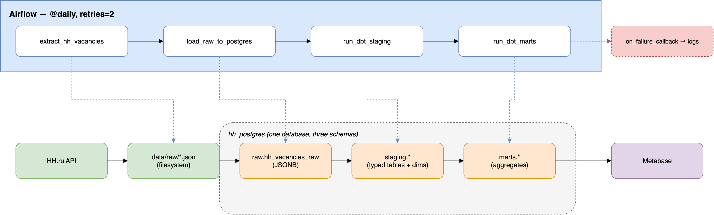

# HH Vacancies Warehouse

A daily pipeline that pulls job vacancies from the [HH.ru API](https://api.hh.ru), lands them in Postgres, transforms them through a layered warehouse with dbt, and serves the results through Metabase — all orchestrated by Airflow and brought up with a single `docker compose up`.

## Architecture



*(diagram: two bands — Airflow's 4-task DAG on top, the raw → staging → marts data layers underneath, with each task pointing down into the layer transition it's responsible for)*

**Pipeline flow:**

```
HH.ru API
   │  fetch.py
   ▼
data/raw/*.json (filesystem — one file per vacancy)
   │  load_raw.py
   ▼
raw.hh_vacancies_raw        (Postgres, JSONB — exact API response, untouched)
   │  dbt run --select staging
   ▼
staging.*                   (typed tables, deduped dimensions, junction tables)
   │  dbt run --select marts
   ▼
marts.*                     (pre-aggregated tables — the actual questions we want answered)
   │
   ▼
Metabase                    (dashboards on top of marts)
```

Orchestrated end to end by an Airflow DAG (`extract_hh_vacancies → load_raw_to_postgres → run_dbt_staging → run_dbt_marts`), scheduled `@daily`.

## Why raw / staging / marts, not just one flat table

- **`raw`** keeps the exact API response as JSONB, nothing parsed out. If a transformation turns out to be wrong, or HH.ru adds a field we didn't know about, we can re-derive everything from `raw` without re-fetching from the API. It's the replay/debugging safety net.
- **`staging`** is where parsing happens exactly once — type casts, pulling nested JSON fields into real columns, deduplicating repeated entities (an employer posting 10 vacancies shouldn't produce 10 copies of its own name/url). Every downstream consumer works with clean typed tables instead of re-parsing JSON paths in every query.
- **`marts`** exists so nobody querying for "average salary by skill" has to know about JSONB, `key_skills` arrays, or how vacancies join to employers. Marts are pre-joined, pre-aggregated, and named after the question they answer.

Each layer is also a natural checkpoint: if `staging` breaks, `raw` is still intact and the fix only needs to re-run one dbt selector (`dbt run --select staging`), not the whole pipeline from the API again.

## Why Airflow, not just a cron job

A cron job can run `python fetch.py && python load_raw.py && dbt run` on a schedule — but it can't answer several things this pipeline actually needs:

- **Ordering with real dependencies, not just sequencing.** If `load_raw_to_postgres` fails, a naive `&&` chain in cron just stops — but Airflow marks exactly that task failed, keeps the failure visible per-task (not as one opaque shell script exit code), and lets `run_dbt_staging` be retried independently once the fix lands, without re-running `extract` again.
- **Retries with backoff, per task.** Each task here retries twice with a 5-minute delay before it's considered failed — the HH API occasionally rate-limits or hiccups, and a transient failure shouldn't require a human to notice and manually re-run a whole script.
- **Backfill control.** `catchup=False` explicitly disables Airflow's default behavior of "run once for every day since start_date" — this matters because the fetch window only covers a 1-day lookback (`HH_WINDOW_DAYS`), so blindly backfilling would just re-run empty/duplicate work, not actually recover missed data. Cron has no concept of this at all; you'd need to hand-roll it.
- **Observability.** The Airflow UI shows exactly which of the 4 stages failed, its logs, how long each took, and history across runs — a cron job's failure mode is usually "check your email for a possibly-truncated stdout dump at 3am."

## Tech stack

- **Ingestion:** Python (`requests`) — `fetch.py`
- **Loading:** Python (`psycopg2`) — `load_raw.py`
- **Warehouse:** Postgres (`raw` / `staging` / `marts` schemas in one database)
- **Transformation:** dbt (`dbt-postgres`)
- **Orchestration:** Airflow (`LocalExecutor`, Dockerized)
- **BI:** Metabase
- **Infra:** Docker Compose (one file, one command)

## Repo structure

```
fetch.py                 # HH.ru API → data/raw/*.json
load_raw.py               # data/raw/*.json → raw.hh_vacancies_raw
data/raw/                 # fetched JSON, gitignored (reproducible via fetch.py)
dbt/hh_warehouse/         # dbt project — models/staging, models/marts
airflow/
  docker-compose.yaml     # the whole stack: Postgres, Airflow, hh_postgres, Metabase
  Dockerfile               # Airflow image + dbt (isolated in its own venv)
  dags/hh_pipeline.py      # the 4-task DAG
  dbt/profiles.yml         # container-side dbt connection profile
```

## Running it

```bash
cd airflow
docker compose up -d
```

Airflow UI: `http://localhost:8080` · Metabase: `http://localhost:3000`

First run: unpause the `hh_pipeline` DAG (starts paused by default) and trigger it manually once before trusting the daily schedule.

## Dashboard


Built on the `marts` tables — average salary by skill, vacancy volume by experience level, top employers by posting count, and weekly posting trends.
